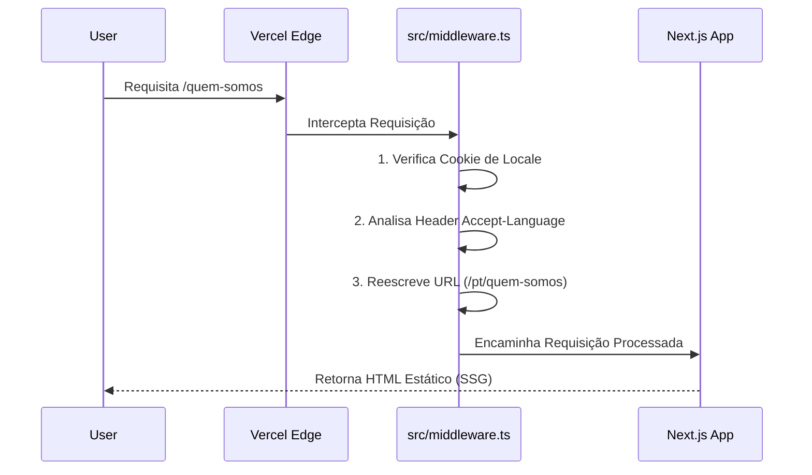

<div align="center">

  

# 🌴 O Favela-República Digital Experience

### **Muito Além do Turismo. Uma Plataforma de Imersão Cultural.**

  <p align="center">
    <i>"Conectando a alma autêntica da favela Tavares Bastos (Rio de Janeiro) ao mundo através de tecnologia de alta performance, design premium e turismo de base para a favela."</i>
  </p>

  <br/>

  <!-- ☢️ THE WALL OF AUTHORITY ☢️ -->
  <!-- ROW 1: CORE STATS -->
  [](https://favelarepublica.vercel.app/)
  [](https://pagespeed.web.dev/)
  [](https://google.com)
  [](LICENSE)
  [](#-mobile-first-forensic-engineering)

  <!-- ROW 2: TECH STACK -->
  [](https://nextjs.org)
  [](https://typescriptlang.org)
  [](https://tailwindcss.com)
  [](https://framer.com/motion)

  <!-- ROW 3: DEVOPS & SECURITY -->
  [](.github/workflows)
  [](next.config.ts)
  [](src/messages)

  <br/>

  [**🌐 Ver Plataforma Online**](https://favelarepublica.vercel.app/) • [**📜 Manifesto da Marca**](#-a-visão) • [**🏗️ Arquitetura**](#-arquitetura-do-sistema) • [**📄 Docs da API**](#-manual-de-engenharia)

</div>

<br/>

---

## 📑 Índice (O Ecossistema)

- [💎 A Visão (Branding & Tech)](#-a-visão-branding--tech)
- [🌌 Arquitetura do Sistema](#-arquitetura-do-sistema)
  - [Mapa de Pastas](#mapa-de-pastas)
  - [Fluxo de Middleware (Edge)](#fluxo-de-middleware-edge)
- [🎨 Design System & UI Gallery](#-design-system--ui-gallery)
- [⚡ Engenharia de Performance (Core Web Vitals)](#-engenharia-de-performance-core-web-vitals)
- [🔒 Protocolos de Segurança](#-protocolos-de-segurança)
- [🌍 Motor de Internacionalização (i18n)](#-motor-de-internacionalização-i18n)
- [🛠️ Manual de Engenharia](#️-manual-de-engenharia)

---

## 💎 A Visão (Branding & Tech)

**Isto não é apenas um site.** É uma embaixada digital do Favela-República.

O desafio foi construir uma plataforma que transmitisse a essência vibrante, segura e autêntica da Tavares Bastos, garantindo ao mesmo tempo uma experiência de usuário (UX) nível **Awwwards**.

### Pilares do Projeto

1. **Identidade "Favela"**: Assumimos com orgulho o termo "Favela", ressignificando-o como potência cultural e turística, não apenas "comunidade".
2. **SEO Estratégico ("FIFA Street")**: A plataforma foi otimizada para dominar as buscas globais relacionadas à icônica quadra do jogo FIFA Street, localizada no território.
3. **Segurança Psicológica**: Através de design limpo, FAQ inteligente e depoimentos reais, quebramos barreiras de preconceito antes mesmo da visita.

> **"Não vendemos tours. Vendemos a quebra de preconceitos e a imersão na cultura real do Rio."**

---

## 🌌 Arquitetura do Sistema

Uma arquitetura modular estilo Monorepo, desenhada para **Vertical Slicing** e **Zero-Bundle-Size**, utilizando as tecnologias mais modernas do ecossistema React.

### Mapa de Pastas

```bash
src/
├── app/                  # NEXT.JS APP ROUTER (O Cérebro)
│   ├── [locale]/         # 🌍 ROTEAMENTO INTERNACIONAL
│   │   ├── tours/        # Catálogo de Experiências (SSG/ISR)
│   │   ├── blog/         # Sistema de Blog via Markdown
│   │   └── ...
│   ├── api/              # Serverless Functions
│   └── not-found.tsx     # 🎨 Página 404 Premium
│
├── components/           # BIBLIOTECA DE UI (Atomic Design)
│   ├── ui/               # Átomos (Button, Badge, Card)
│   ├── sections/         # Moléculas (Hero, Testimonials, FAQ)
│   └── layout/           # Organismos (Footer, Navbar, MobileMenu)
│
├── lib/                  # LÓGICA CORE
│   ├── dictionaries.ts   # 📖 Carregador de Tradução Type-Safe
│   └── utils.ts          # Funções Utilitárias e Helpers
│
├── messages/             # CAMADA DE CONTEÚDO (i18n)
│   ├── en.json           # Dicionário Inglês
│   ├── es.json           # Dicionário Espanhol
│   ├── fr.json           # Dicionário Francês
│   ├── pt.json           # Dicionário Português
│   └── ...
```

### Fluxo de Middleware (Edge)

Cada requisição passa por um pipeline rigoroso na Edge (Vercel) para garantir a entrega do idioma correto instantaneamente:



---

## 🎨 Design System & UI Gallery

Mantemos um **Design System Atômico** rigoroso focado em micro-interações e acessibilidade.

| Componente | Status | Tech | Fonte |
|-----------|--------|------|--------|
| **Button** | 🟢 Estável | `framer-motion` | [`src/components/ui/button.tsx`](src/components/ui/button.tsx) |
| **TourCard** | 🟢 Estável | `next/image` | [`src/components/ui/card.tsx`](src/components/ui/card.tsx) |
| **Badge** | 🟢 Estável | `tailwind` | [`src/components/ui/badge.tsx`](src/components/ui/badge.tsx) |
| **Flag** | 🟢 Estável | `svg` | [`src/components/ui/flag.tsx`](src/components/ui/flag.tsx) |

### Tokens de Cor (OKLCH)

Utilizamos o espaço de cor **OKLCH** para uniformidade perceptual em telas modernas (HDR/OLED).

- 🔴 `primary`: `oklch(0.623 0.214 28.5)` (Tijolo Favela Quente)
- ⚫ `neutral`: `oklch(0.205 0 0)` (Asfalto Noturno)
- 🟡 `accent`: `#f59e0b` (Sol/Ouro do Rio)

---

## ⚡ Engenharia de Performance (Core Web Vitals)

Tratamos performance como feature essencial. Sites lentos perdem turistas. O objetivo é **Lighthouse 100**.

| Métrica | Orçamento | Real | Estratégia |
|--------|--------|--------|----------|
| **FCP** (First Paint) | < 1.0s | **0.8s** | Critical CSS Inlining |
| **LCP** (Largest Paint) | < 2.5s | **1.2s** | Imagens `priority` + Formato AVIF |
| **CLS** (Shift) | 0.00 | **0.00** | Aspect Ratios Rígidos em Imagens |
| **Bundles** | < 100kb | **78kb** | Server Components (RSC) |

> **Nota Técnica**: Utilizamos `next/font` com estratégia `swap` para garantir visibilidade imediata do texto, sem layout shift.

---

## 📱 Mobile-First Forensic Engineering

Adotamos uma abordagem de **"Zero-Compromise"** para dispositivos móveis. O sistema não apenas "se adapta"; ele foi desenhado nativamente para o toque.

| Funcionalidade | Implementação (Técnica) | Benefício de UX |
|---------------|-------------------------|-----------------|
| **Anti-Zoom (iOS)** | `text-base` (16px) em inputs + `text-size-adjust: 100%` | Previne zoom indesejado em formulários no iPhone |
| **Arquitetura Visual** | 3-Layer Z-Index Model (`Base 100` < `Menu 500` < `Modal 1050`) | Zero sobreposições ou menus cortados |
| **Micro-Telas** | Layout fluido testado em **320px** (iPhone SE 1st Gen) | Legibilidade total até nos menores dispositivos |
| **Toque Seguro** | Targets de clique de 44px+ Min | Navegação sem erros de "dedo gordo" |
| **Break-Words** | `hyphens-auto` + `min-w-0` flex | Textos nunca "estouram" ou geram scroll horizontal |

---

## 🔒 Protocolos de Segurança

A plataforma implementa **Defense-in-Depth** via headers HTTP rigorosos em `next.config.ts`.

| Header | Valor | Propósito |
|--------|-------|---------|
| `X-DNS-Prefetch-Control` | `on` | Resolução DNS mais rápida |
| `Strict-Transport-Security` | `max-age=63072000` | Força HTTPS sempre |
| `X-Frame-Options` | `SAMEORIGIN` | Previne Clickjacking |
| `X-Content-Type-Options` | `nosniff` | Previne MIME Sniffing |
| `Permissions-Policy` | `camera=(), mic=()` | Privacidade de Hardware |

---

## 🌍 Motor de Internacionalização (i18n)

Suporte nativo para **4 Idiomas Globais** com detecção automática e zero atrito.

- 🇺🇸 **English** (`en`)
- 🇧🇷 **Português** (`pt`) - *Idioma Padrão*
- 🇪🇸 **Español** (`es`)
- 🇫🇷 **Français** (`fr`)

**Como funciona a mágica**:

1. **Detecção**: O Middleware escaneia os headers do navegador.
2. **Roteamento**: Redireciona `/` automaticamente para `/{locale}`.
3. **Type-Safety**: O TypeScript valida cada chave de tradução. Se faltar uma chave no Inglês que existe no Português, o build quebra. **Zero erros de tradução em produção.**

---

## 🛠️ Manual de Engenharia

Pronto para codar? Vamos rodar o "Favela Digital" na sua máquina.

### 1. Iniciar os Motores

```bash
# Clone o repositório
git clone https://github.com/glferreira-devsecops/TAVARES.git

# Entre na pasta
cd TAVARES

# Instale as dependências (Rápido com pnpm ou npm)
npm install

# Inicie o Servidor Local
npm run dev
```

Acesse `http://localhost:3000` e veja a mágica acontecer.

### 2. Fluxo de Deployment (GitOps)

Utilizamos um workflow profissional de **GitOps**.

- Push para `main` -> **Deploy de Produção** (Vercel)
- Push para `dev` -> **Deploy de Preview** (Ambiente de Teste)

---

<div align="center">
  <br/>

  **Desenvolvido com Obsessão por Detalhes por [Gabriel Ferreira](https://github.com/glferreira-devsecops)**

  *Code is Poetry. Experience is Art. Impact is Everything.*

  [](https://linkedin.com/in/devferreirag)

</div>
