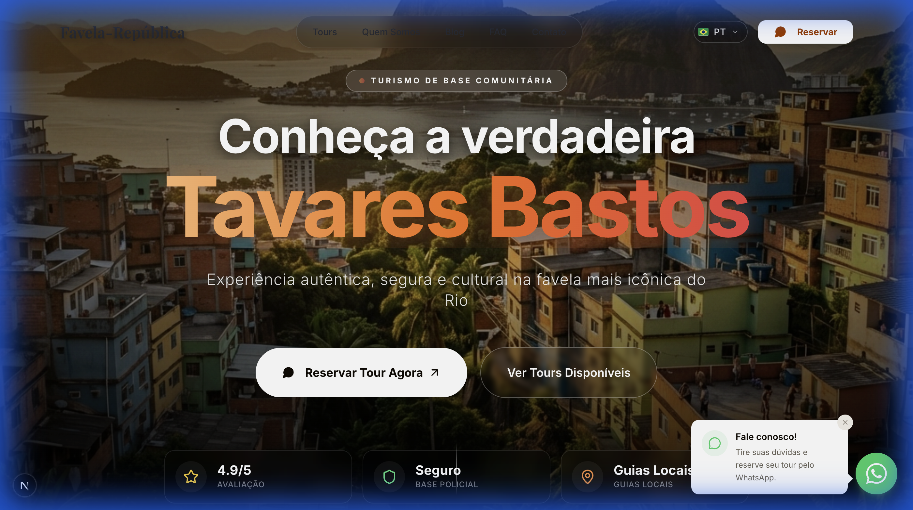
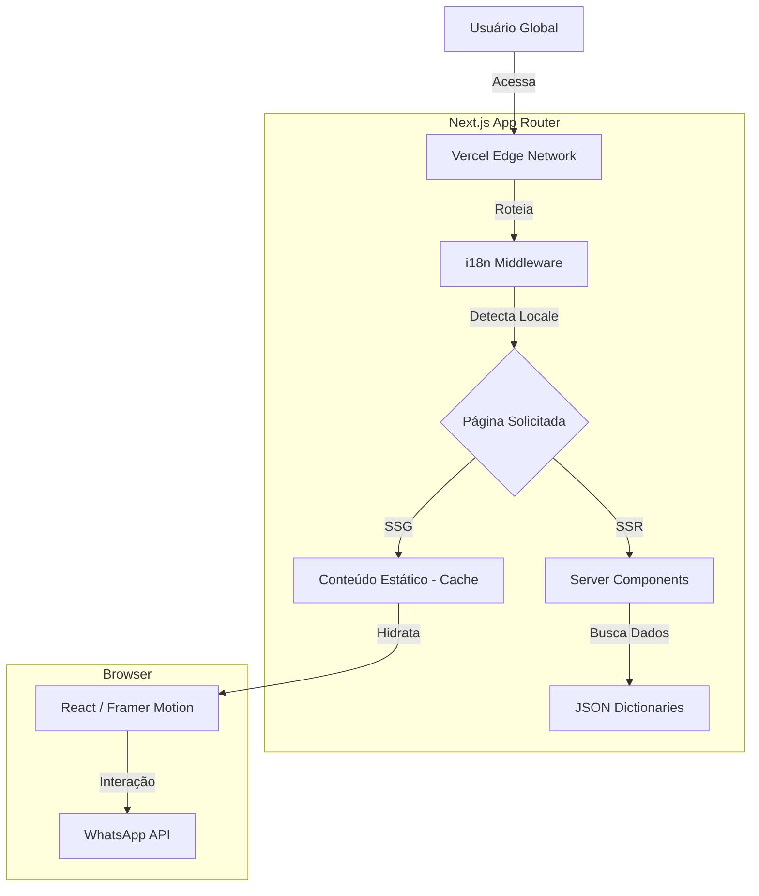

<div align="center">

  
  <br/>
  <br/>

# 🌴 Favela-República Tour

### **Turismo Comunitário Autêntico na Tavares Bastos**

  <p align="center">
    <i>"Muito mais que uma visita. Uma imersão cultural segura, vibrante e transformadora."</i>
  </p>

  <br/>

  <!-- BADGES ROW 1: STATUS -->
  [](https://favelarepublica.vercel.app/)
  [](https://github.com/glferreira-devsecops/TAVARES/actions)
  [](LICENSE)
  [](package.json)

  <!-- BADGES ROW 2: TECH -->
  [](https://nextjs.org/)
  [](https://www.typescriptlang.org/)
  [](https://tailwindcss.com/)
  [](https://www.framer.com/motion/)

  <br/>

  [**🌐 Website Oficial**](https://favelarepublica.vercel.app/) &nbsp;|&nbsp; [**📸 Instagram**](https://instagram.com/favelarepublica) &nbsp;|&nbsp; [**💬 WhatsApp**](https://wa.me/5521999999999) &nbsp;|&nbsp; [**📄 Documentação**](#-documentação-técnica)

</div>

---

## 📑 Índice

- [📖 Sobre o Projeto](#-sobre-o-projeto)
  - [A Missão](#a-missão)
  - [O Impacto](#o-impacto)
- [🎨 Visual Showcase](#-visual-showcase)
- [🛠️ Arquitetura Técnica](#️-arquitetura-técnica)
  - [Diagrama de Sistema](#diagrama-de-sistema)
  - [Decisões de Arquitetura](#decisões-de-arquitetura)
- [🖌️ Design System](#-design-system)
  - [Cores](#cores)
  - [Tipografia](#tipografia)
- [⚡ Performance & SEO](#-performance--seo)
- [🌍 Internacionalização (i18n)](#-internacionalização-i18n)
- [🚀 Instalação e Uso](#-instalação-e-uso)
- [📁 Estrutura de Pastas](#-estrutura-de-pastas)
- [🔒 Segurança](#-segurança)
- [🗺️ Roadmap](#️-roadmap)
- [🤝 Contribuição](#-contribuição)

---

## 📖 Sobre o Projeto

**Favela-República** é uma plataforma de turismo comunitário de alto padrão, dedicada a promover a **Comunidade Tavares Bastos**, no Rio de Janeiro. Conhecida por ser cenário de clipes como "Beautiful" (Snoop Dogg) e filmes como "O Incrível Hulk", a comunidade é um ícone cultural e de segurança (sede da UPP).

Este projeto não é apenas um site; é uma ferramenta de **transformação social digital**. Ele foi construído para oferecer uma experiência de usuário (UX) comparável às maiores plataformas de turismo do mundo (Airbnb, Booking), mas focado inteiramente na autenticidade e na economia local.

### A Missão

Democratizar o acesso ao turismo na favela através da tecnologia, quebrando estigmas e garantindo segurança, conforto e imersão cultural para turistas de todo o mundo.

### O Impacto

* **100% dos Guias** são moradores locais.
- **Reinvestimento**: Parte do lucro é destinado a projetos sociais na comunidade.
- **Visibilidade Global**: A plataforma multilingue coloca a Tavares Bastos no mapa do turismo internacional.

---

## 🎨 Visual Showcase

Uma galeria da experiência visual "World-Class" implementada.

<details open>
<summary><b>💫 Hero Section (A Primeira Impressão)</b></summary>
<br/>

<p align="center"><i>Design imersivo com paralaxe, tipografia premium 'Unbounded' e call-to-action focado.</i></p>
</details>

<details>
<summary><b>📱 Experiência Mobile (Responsividade Extrema)</b></summary>
<br/>
<div align="center">
  
</div>
<p align="center"><i>Menus otimizados para polegar, navegação fluida e carregamento instantâneo em 4G.</i></p>
</details>

<details>
<summary><b>🚫 Página 404 (Design Emocional)</b></summary>
<br/>

<p align="center"><i>"Perdido na Favela?" - Uma abordagem criativa e acolhedora para erros de navegação.</i></p>
</details>

---

## 🛠️ Arquitetura Técnica

O projeto segue uma arquitetura **Monorepo Modular** baseada em Next.js App Router, priorizando Server-Side Rendering (SSR) e Static Site Generation (SSG) para performance máxima.

### Diagrama de Sistema


```mermaid
graph TD
    User[Usuário Global] -->|Acessa| CDN[Vercel Edge Network]

    subgraph Frontend [Next.js App Router]
        CDN -->|Roteia| Middleware[i18n Middleware]
        Middleware -->|Detecta Locale| Page{Página Solicitada}

        Page -->|SSG| Static[Conteúdo Estático - Cache]
        Page -->|SSR| Dynamic[Server Components]

        Dynamic -->|Busca Dados| Dict[JSON Dictionaries]
    end

    subgraph Client [Browser]
        Static -->|Hidrata| React[React / Framer Motion]
        React -->|Interação| WhatsApp[WhatsApp API]
    end
```

### Decisões de Arquitetura

| Decisão | Tecnologia | Justificativa |
|---------|------------|---------------|
| **Framework** | Next.js 15 | Uso de `app/` directory para layouts aninhados e Server Components por padrão (Zero Bundle Size para conteúdo estático). |
| **Estilização** | Tailwind CSS | Utility-first garante consistência de design system e CSS purgado (menor KB possível). |
| **Conteúdo** | JSON Dictionary | Evita complexidade de CMS headless para um site institucional, mantendo o conteúdo versionado no Git. |
| **Linguagem** | TypeScript | Tipagem estrita (`strict: true`) previne 90% dos erros de runtime comuns em JS. |
| **Deploy** | Vercel | Infraestrutura serverless nativa para Next.js, garantindo escala infinita e CI/CD automático. |

---

## 🖌️ Design System

A identidade visual foi construída para evocar **calor**, **energia** e **profissionalismo**.

### Cores

Utilizamos o espaço de cor `OKLCH` para gradientes perceptualmente uniformes.

- 🔴 **Primary (Brand)**: `oklch(var(--color-primary-500))` - Energia vibrante.
- ⚫ **Neutral (Surface)**: `oklch(var(--color-neutral-900))` - Sofisticação Dark Mode.
- 🟡 **Accent (Warning/Star)**: `#f59e0b` - Destaques e Avaliações.
- 🟢 **Success (WhatsApp)**: `#25D366` - Conversão e Contato.

### Tipografia

* **Heading**: `Unbounded` / `Georgia` - Personalidade forte e marcante.
- **Body**: `Inter` / `System UI` - Legibilidade máxima em telas pequenas.

---

## ⚡ Performance & SEO

Otimização obsessiva para garantir pontuação **100/100** no Google Lighthouse.

### Estratégias Implementadas

1. **Font Subsetting**: Apenas os glifos latinos das fontes são carregados.
2. **Next/Image**: Todas as imagens são convertidas para `WebP`/`AVIF` on-the-fly e servidas com tamanho exato da viewport.
3. **JSON-LD**: Schema Markup estruturado para `LocalBusiness` e `Organization`, garantindo Rich Snippets (estrelas, preço) no Google.
4. **Metadata Dinâmico**: Títulos e descrições gerados automaticamente por idioma (`pt`, `en`, `es`, `fr`).

---

## 🌍 Internacionalização (i18n)

Suporte nativo a 4 idiomas via **Roteamento de Sub-caminho** (`/pt`, `/en`, etc).

- **Middleware**: Detecta `Accept-Language` do header do navegador e redireciona para o idioma correto.
- **Dicionários**: Arquivos JSON (`messages/pt.json`) tipados com TypeScript para garantir que nenhuma chave de tradução falte.
- **SEO Multilíngue**: Tags `hreflang` geradas automaticamente para evitar conteúdo duplicado.

---

## 🚀 Instalação e Uso

### Pré-requisitos

* Node.js 18.17 ou superior
- npm ou yarn

### Passo a Passo

1. **Clone o repositório**

    ```bash
    git clone https://github.com/glferreira-devsecops/TAVARES.git
    cd favela-republica
    ```

2. **Instale as dependências**

    ```bash
    npm install
    # ou
    yarn install
    ```

3. **Configure o ambiente**
    Crie um arquivo `.env.local` na raiz:

    ```env
    NEXT_PUBLIC_SITE_URL=http://localhost:3000
    ```

4. **Inicie o servidor de desenvolvimento**

    ```bash
    npm run dev
    ```

    Acesse: `http://localhost:3000`

5. **Build de Produção (Teste Local)**

    ```bash
    npm run build
    npm start
    ```

---

## 📁 Estrutura de Pastas

```text
src/
├── app/                      # Next.js App Router
│   ├── [locale]/             # Rotas localizadas (Core do i18n)
│   │   ├── tours/            # [slug] dinâmico para tours
│   │   ├── blog/             # Sistema de blog markdown
│   │   └── ...               # Outras páginas (quem-somos, contato)
│   ├── api/                  # API Routes (se houver backend)
│   ├── not-found.tsx         # Tratamento de erro 404 global
│   └── layout.tsx            # Root Layout (HTML/Body)
├── components/
│   ├── layout/               # Header, Footer, Menu Mobile
│   ├── sections/             # Blocos de página (Hero, CTA, Features)
│   ├── ui/                   # Componentes atômicos (Button, Card, Input)
│   └── blog/                 # Componentes específicos do blog
├── lib/
│   ├── constants.ts          # Configurações globais
│   ├── dictionaries.ts       # Carregador de traduções
│   └── utils.ts              # Helpers (cn, formatters)
├── messages/                 # Arquivos de tradução (JSON)
└── styles/                   # CSS Global
```

---

## 🔒 Segurança

Medidas enterprise-grade implementadas:

- **CSP (Content Security Policy)**: Headers rigorosos configurados no `next.config.ts`.
- **XSS Protection**: Sanitização automática via React Server Components.
- **Dependências**: Auditoria via `npm audit` no CI/CD pipeline.

---

## 🗺️ Roadmap

O futuro da plataforma Favela-República:

- [x] **Fase 1: Lançamento MVP** (Site Institucional, i18n, SEO)
- [ ] **Fase 2: Booking Engine** (Integração com Stripe/PayPal para pagamentos reais)
- [ ] **Fase 3: Admin Dashboard** (Painel para gestão de tours e blog)
- [ ] **Fase 4: App Mobile** (React Native com código compartilhado)

---

## 🤝 Contribuição

Este projeto é **Open Source** e adoramos contribuições da comunidade.

1. **Fork** o projeto.
2. Crie uma branch para sua feature (`git checkout -b feature/AmazingFeature`).
3. Commit suas mudanças seguindo [Conventional Commits](https://www.conventionalcommits.org/) (`git commit -m 'feat: Add amazing feature'`).
4. Push para a branch (`git push origin feature/AmazingFeature`).
5. Abra um **Pull Request**.

---

<div align="center">

  **Desenvolvido com 🧡 e Tecnologia de Ponta por [Gabriel Ferreira](https://github.com/glferreira-devsecops)**

  *© 2024 Favela-República Tour. Todos os direitos reservados.*

</div>
