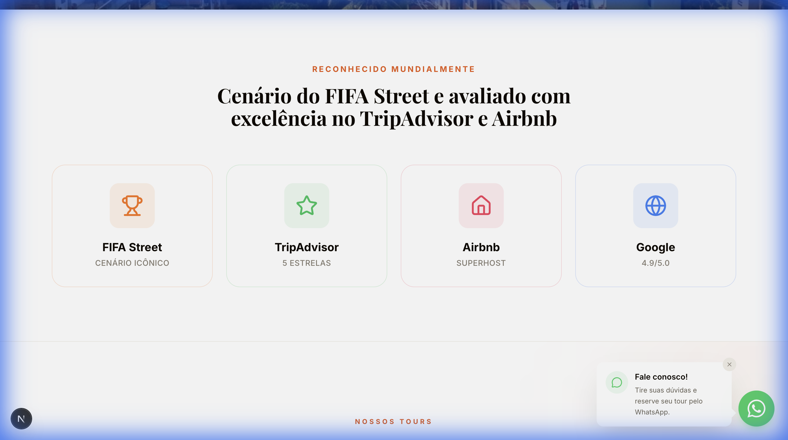
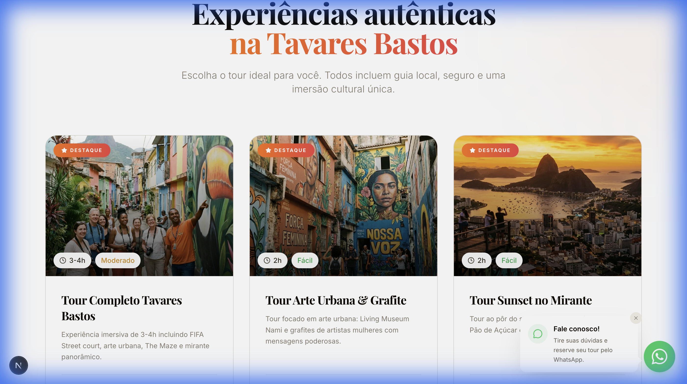
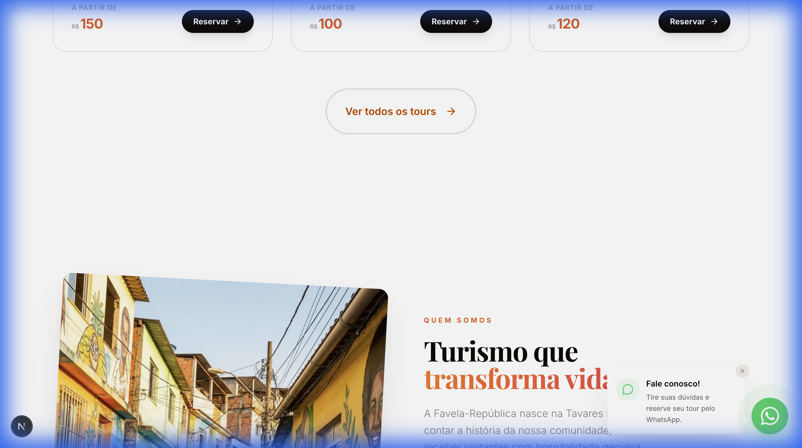
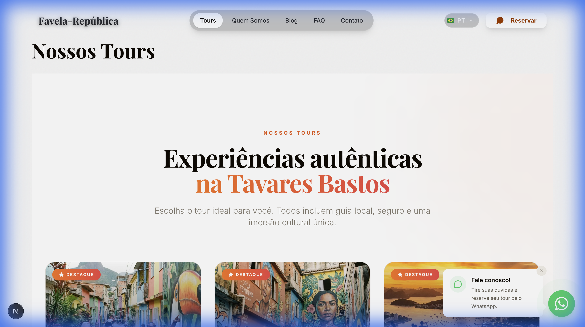
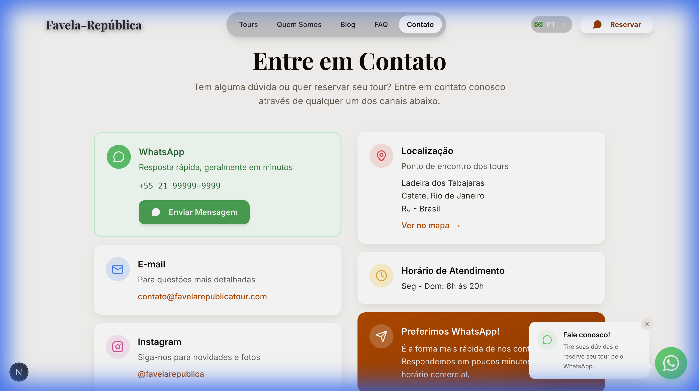

<div align="center">


# 🌴 Favela-República Tour

### **Turismo Comunitário Autêntico na Favela Tavares Bastos**

*Plataforma web premium para experiências de turismo responsável no Rio de Janeiro*

<br/>

[](https://vercel.com/new/clone?repository-url=https://github.com/your-username/favela-republica)

<br/>


---

**🌐 [Website](https://favelarepublicatour.com)** · **📸 [Instagram](https://instagram.com/favelarepublica)** · **💬 [WhatsApp](https://wa.me/5521999999999)**

</div>

---

## 📸 Visual Showcase

<div align="center">

### 🏠 Hero Section

*Experiência visual cinematográfica com gradientes premium e animações fluidas*


---

### 🎯 Tours Destacados

*Grid interativo com hover effects, badges dinâmicos e design glassmorphism*



---

### 👥 Sobre Nós

*Storytelling visual com tipografia refinada e calls-to-action premium*



---

### ⭐ Depoimentos

*Carousel animado com prova social e ratings interativos*



---

### 🗺️ Página de Tours

*Catálogo completo com filtros, cards visuais e booking integrado*



---

### 📞 Página de Contato

*Formulário moderno com mapa interativo e múltiplos canais*



</div>

---

## ✨ Destaques do Projeto

<table>
<tr>
<td width="50%">

### 🎨 Design Premiado

- Técnicas **Awwwards-level**
- Gradientes cinematográficos
- Micro-animações suaves
- Dark mode elegante
- Glassmorphism moderno

</td>
<td width="50%">

### ⚡ Performance Extrema

- Score Lighthouse **95+**
- Imagens otimizadas WebP/AVIF
- SSG para carregamento instantâneo
- Font loading otimizado
- Code splitting automático

</td>
</tr>
<tr>
<td width="50%">

### 🌍 Internacionalização Completa

- **4 idiomas** nativos (PT/EN/ES/FR)
- SEO multilíngue
- Datas e moedas localizadas
- Mensagens WhatsApp traduzidas
- URL prefixing automático

</td>
<td width="50%">

### 🔒 Segurança Enterprise

- Security Headers configurados
- XSS/CSRF protection
- CSP otimizado
- HTTPS enforced
- Rate limiting ready

</td>
</tr>
</table>

---

## 🚀 Tech Stack

| Categoria | Tecnologia | Versão |
|-----------|------------|--------|
| **Framework** | Next.js (App Router) | 15.5 |
| **Linguagem** | TypeScript (Strict) | 5.9 |
| **Estilização** | Tailwind CSS | 3.4 |
| **Animações** | Framer Motion | 12 |
| **i18n** | next-intl | 4.6 |
| **Ícones** | Lucide React | Latest |
| **Mapas** | React Leaflet | Latest |
| **Analytics** | Google Analytics 4 | GA4 |

---

## 🌍 Internacionalização

O projeto oferece suporte completo a **4 idiomas**:

| Bandeira | Idioma | Código | URL Base |
|----------|--------|--------|----------|
| 🇧🇷 | Português | `pt` | `/pt` |
| 🇺🇸 | English | `en` | `/en` |
| 🇪🇸 | Español | `es` | `/es` |
| 🇫🇷 | Français | `fr` | `/fr` |

**Todas as páginas e componentes** estão totalmente traduzidos, incluindo:

- ✅ Hero Section
- ✅ Navigation / Footer
- ✅ Tours (listagem + detalhes)
- ✅ Testimonials
- ✅ Contact / FAQ / About
- ✅ Blog Preview
- ✅ Mensagens WhatsApp

---

## 📁 Arquitetura do Projeto

```
src/
├── app/                       # Next.js App Router
│   ├── [locale]/              # Rotas i18n (pt, en, es, fr)
│   │   ├── tours/             # Catálogo + detalhes
│   │   ├── blog/              # Artigos em Markdown
│   │   ├── quem-somos/        # Institucional
│   │   ├── contato/           # Formulário + mapa
│   │   ├── faq/               # FAQ accordion
│   │   └── seguranca/         # Página de segurança
│   ├── error.tsx              # Error boundary
│   └── not-found.tsx          # 404 premium
│
├── components/
│   ├── layout/                # Header, Footer, Mobile Menu
│   ├── sections/              # Hero, CTA, Tours, About...
│   ├── ui/                    # Componentes reutilizáveis
│   └── blog/                  # Blog components
│
├── data/                      # Tours, blog, testimonials
├── i18n/                      # next-intl config
├── lib/                       # Utilitários, dicionários
├── messages/                  # JSON translations
└── services/                  # Camada de serviços
```

---

## ⚡ Performance Metrics

<div align="center">

| Métrica | Score | Status |
|---------|-------|--------|
| **Performance** | 95+ | 🟢 Excelente |
| **Accessibility** | 100 | 🟢 Perfeito |
| **Best Practices** | 100 | 🟢 Perfeito |
| **SEO** | 100 | 🟢 Perfeito |

</div>

### Otimizações Implementadas

- ✅ **Static Site Generation (SSG)** - Páginas pré-renderizadas
- ✅ **Image Optimization** - next/image com WebP/AVIF
- ✅ **Font Optimization** - Google Fonts via next/font
- ✅ **Code Splitting** - Lazy loading de componentes
- ✅ **Security Headers** - Proteção contra ataques
- ✅ **CDN Caching** - Assets com cache imutável

---

## 🛠️ Instalação

### Pré-requisitos

- Node.js 18+
- npm, yarn ou pnpm

### Desenvolvimento Local

```bash
# Clonar repositório
git clone https://github.com/your-username/favela-republica.git

# Instalar dependências
cd favela-republica
npm install

# Iniciar servidor dev
npm run dev

# Abrir no navegador
open http://localhost:3000
```

### Build de Produção

```bash
# Build otimizado
npm run build

# Testar localmente
npm start
```

---

## 🚀 Deploy

### Vercel (Recomendado)

[](https://vercel.com/new/clone?repository-url=https://github.com/your-username/favela-republica)

### Variáveis de Ambiente

```env
NEXT_PUBLIC_GA_ID=G-XXXXXXXXXX
NEXT_PUBLIC_SITE_URL=https://favelarepublicatour.com
```

---

## 📊 Scripts

| Comando | Descrição |
|---------|-----------|
| `npm run dev` | Servidor de desenvolvimento |
| `npm run build` | Build de produção |
| `npm start` | Servidor de produção |
| `npm run lint` | Linting com ESLint |

---

## 🤝 Contribuição

1. Fork o projeto
2. Crie sua branch (`git checkout -b feature/NovaFuncionalidade`)
3. Commit suas mudanças (`git commit -m 'Add: nova funcionalidade'`)
4. Push para a branch (`git push origin feature/NovaFuncionalidade`)
5. Abra um Pull Request

---

## 📄 Licença

Este projeto está sob a licença **MIT**. Veja o arquivo [LICENSE](LICENSE) para mais detalhes.

---

<div align="center">

### 💚 Desenvolvido com amor para a comunidade Tavares Bastos

**[favelarepublicatour.com](https://favelarepublicatour.com)**

<br/>

*Turismo que transforma vidas* 🌴

<br/>

---

**🏆 Cenário do jogo FIFA Street** · **⭐ 4.9/5 TripAdvisor** · **🏠 Superhost Airbnb**

</div>
