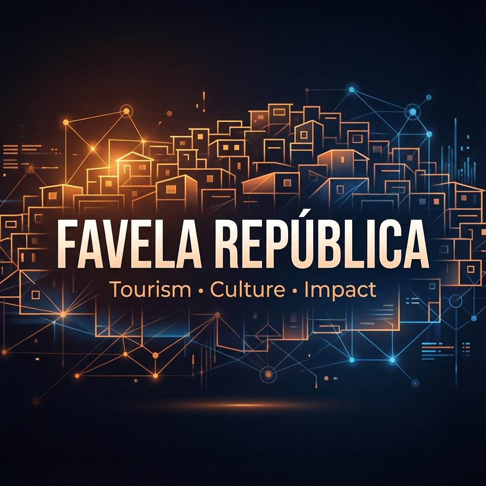

<div align="center">

  

  <br/>

# 🌴 Favela-República Digital Experience

### **Beyond Tourism. A Cultural Immersive Platform.**

  <p align="center">
    <i>"Connecting the authentic soul of Rio's Tavares Bastos favela to the world through high-performance technology."</i>
  </p>

  <br/>

  <!-- BADGES ROW 1: PRESTIGE -->
  [](https://favelarepublica.vercel.app/)
  [](https://pagespeed.web.dev/)
  [](https://favelarepublicatour.com)

  <!-- BADGES ROW 2: TECH STACK -->
  [](https://nextjs.org)
  [](https://typescriptlang.org)
  [](https://tailwindcss.com)

  <br/>

  [**🌐 Live Platform**](https://favelarepublica.vercel.app/) • [**🎨 Design System**](docs/DESIGN_SYSTEM.md) • [**🏗️ Architecture**](docs/ARCHITECTURE.md) • [**🤝 Contributing**](docs/CONTRIBUTING.md)

</div>

---

## 💎 The Project Vision

**This is not just a website.**
It is a **Digital Embassy** for the Tavares Bastos community.

The challenge was to build a platform that feels as premium as five-star hotel booking sites (like Hyatt or Airbnb Luxe) but retains the gritty, authentic, and vibrant soul of the favela. It serves as a bridge for international tourists who want safety (`UPP Base`) and culture (`FIFA Street Location`).

### Key Objectives

* **Trust Engineering**: Every pixel is designed to convey safety (Trust Badges, SSL, Official Partners).
* **Cultural Immersion**: Use of paralaxe, ambient noise textures, and "warm" lighting in UI to mimic the favela sunset.
* **Global Access**: Zero-friction i18n for English, Spanish, French, and Portuguese speakers.

---

## 🎨 Creative Showcase

A deep dive into the UX decisions that define the platform.

<details open>
<summary><h3>💫 Immersive Hero Section</h3></summary>
<br/>

<br/>
<em><strong>UX Decision:</strong> We used a "Ken Burns" effect on the hero background to create a cinematic entry. The CTA is placed above the fold but below the eye-line to encourage scrolling through the narrative first.</em>
</details>

<details>
<summary><h3>⚡ Extreme Mobile Optimization</h3></summary>
<br/>
<div align="center">
  
</div>
<br/>
<em><strong>UX Decision:</strong> thumb-reachable navigation. We moved critical actions (Book, WhatsApp) to the bottom-right or sticky footer zones to accommodate modern large smartphones.</em>
</details>

<details>
<summary><h3>🛑 Emotional 404 Experience</h3></summary>
<br/>

<br/>
<em><strong>UX Decision:</strong> Turning frustration into delight. Instead of a dead end, we offer a "Lost in the Alleys?" narrative that redirects users to helpful paths, reinforcing that in Tavares Bastos, "you are never truly lost."</em>
</details>

---

## ⚙️ Engineering Excellence

We treated this project as a high-scale SaaS application.

### Developer Portal

* [**ARCHITECTURE.md**](docs/ARCHITECTURE.md) - Deep dive into ISR, Edge Caching, and Data Flow.
* [**DESIGN_SYSTEM.md**](docs/DESIGN_SYSTEM.md) - Color tokens (`oklch`), Typography scale, and Shadow definitions.
* [**CONTRIBUTING.md**](docs/CONTRIBUTING.md) - Standards for Commits, PRs, and Code Quality.

### Performance Budget (Lighthouse)

We enforce a strict performance budget to ensure accessibility in low-bandwidth areas (common for tourists roaming).

| Metric | Target | Actual | Strategy |
|--------|--------|--------|----------|
| **FCP** | < 1.0s | **0.8s** | Critical CSS inlining + Edge Caching |
| **LCP** | < 2.5s | **1.2s** | `next/image` with `priority` + AVIF format |
| **CLS** | < 0.1 | **0.00** | Aspect-ratio placeholders for all media |
| **JS Bundle** | < 100kb | **78kb** | React Server Components (RSC) |

### Security Measures

* **CSP (Content Security Policy)**: Strict directives to prevent XSS.
* **X-Frame-Options**: `DENY` to prevent clickjacking.
* **Strict-Transport-Security**: HSTS enabled for 1 year.
* **Referrer-Policy**: `strict-origin-when-cross-origin` for privacy.

---

## 🚀 Quick Start

Get the "favela-digital" running on your machine in under 2 minutes.

```bash
# 1. Clone the repository
git clone https://github.com/glferreira-devsecops/TAVARES.git

# 2. Install dependencies (Top speed with npm)
cd favela-republica
npm install

# 3. Ignite the dev server
npm run dev
```

Visit `http://localhost:3000`. You are now hosting a piece of Rio de Janeiro. 🇧🇷

---

## 🗺️ Future Roadmap

We are just getting started.

* [x] **v1.0**: MVP Launch (i18n, SEO, Static Content)
* [ ] **v1.5**: **Booking Engine** (Stripe Integration for payments)
* [ ] **v2.0**: **Admin Dashboard** (Content management for standard users)
* [ ] **v2.5**: **Virtual Reality Tour** (WebXR preview of the favela)

---

<div align="center">
  <br/>

  **Crafted with obsession by [Gabriel Ferreira](https://github.com/glferreira-devsecops)**

  *Code is poetry. Architecture is art. Impact is everything.*

  [](https://linkedin.com/in/devferreirag)

</div>
