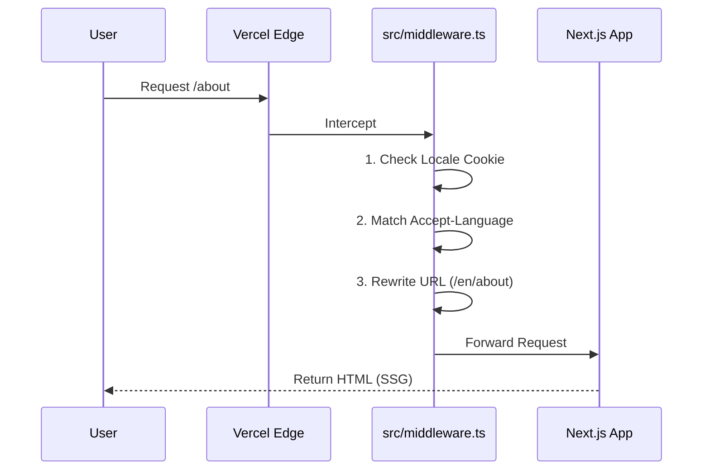

<div align="center">

  

# 🌴 Favela-República Digital Experience

### **Beyond Tourism. A Cultural Immersive Platform.**

  <p align="center">
    <i>"Connecting the authentic soul of Rio's Tavares Bastos favela to the world through high-performance technology."</i>
  </p>

  <br/>

  <!-- ☢️ THE BADGE WALL ☢️ -->
  <!-- ROW 1: CORE STATS -->
  [](https://favelarepublica.vercel.app/)
  [](https://pagespeed.web.dev/)
  [](package.json)
  [](LICENSE)

  <!-- ROW 2: TECH STACK -->
  [](https://nextjs.org)
  [](https://typescriptlang.org)
  [](https://tailwindcss.com)
  [](https://framer.com/motion)

  <!-- ROW 3: DEVOPS & SECURITY -->
  [](.github/workflows)
  [](next.config.ts)
  [](src/messages)

  <br/>

  [**🌐 Live Platform**](https://favelarepublica.vercel.app/) • [**🎨 Design System**](docs/DESIGN_SYSTEM.md) • [**🏗️ Architecture**](docs/ARCHITECTURE.md) • [**📄 API Docs**](#-api-routes)

</div>

<br/>

---

## 📑 Table of Contents (The Ecosystem)

- [💎 The Vision](#-the-vision)
- [🌌 System Architecture](#-system-architecture)
  - [Folder Map](#folder-map)
  - [Middleware Flow](#middleware-flow)
- [🎨 Design System & UI Gallery](#-design-system--ui-gallery)
- [⚡ Performance Engineering](#-performance-engineering)
- [🔒 Security Protocol](#-security-protocol)
- [🌍 Internationalization Engine](#-internationalization-engine)
- [🛠️ Developer Guide](#️-developer-guide)

---

## 💎 The Vision

**This is not a website.** It is a digital embassy.

The challenge was to build a platform that feels as premium as **Airbnb Luxe** but retains the gritty, authentic, and vibrant soul of the favela. It serves as a digital bridge for international tourists who want safety (`UPP Base`) and culture (`FIFA Street Location`).

> **"We don't sell tours. We sell the breaking of prejudices."**

---

## 🌌 System Architecture

A Monorepo-style modular architecture designed for **Vertical Slicing** and **Zero-Bundle-Size**.

### Folder Map

```bash
src/
├── app/                  # NEXT.JS APP ROUTER
│   ├── [locale]/         # 🌍 I18N ROUTING ROOT
│   │   ├── tours/        # Tour Catalog (SSG)
│   │   ├── blog/         # Markdown Blog System
│   │   └── ...
│   ├── api/              # Serverless Functions
│   └── not-found.tsx     # 🎨 Premium 404 Page
│
├── components/           # UI LIBRARY
│   ├── ui/               # Atom Components (Button, Card)
│   ├── sections/         # Molecules (Hero, Testimonials)
│   └── layout/           # Organisms (Footer, Navbar)
│
├── lib/                  # CORE LOGIC
│   ├── dictionaries.ts   # 📖 Type-safe Translation Loader
│   └── utils.ts          # Helper Functions
│
├── messages/             # CONTENT LAYER
│   ├── en.json           # English Dictionary
│   ├── pt.json           # Portuguese Dictionary
│   └── ...
```

### Middleware Flow

Every request goes through a rigorous pipeline on the Edge:


```mermaid
sequenceDiagram
    participant User
    participant Edge as Vercel Edge
    participant Middleware as src/middleware.ts
    participant App as Next.js App

    User->>Edge: Request /about
    Edge->>Middleware: Intercept
    Middleware->>Middleware: 1. Check Locale Cookie
    Middleware->>Middleware: 2. Match Accept-Language
    Middleware->>Middleware: 3. Rewrite URL (/en/about)
    Middleware->>App: Forward Request
    App-->>User: Return HTML (SSG)
```

---

## 🎨 Design System & UI Gallery

We maintain a strict **Atomic Design** system. Component sources are linked below.

| Component | Status | Tech | Source |
|-----------|--------|------|--------|
| **Button** | 🟢 Stable | `framer-motion` | [`src/components/ui/button.tsx`](src/components/ui/button.tsx) |
| **TourCard** | 🟢 Stable | `next/image` | [`src/components/ui/card.tsx`](src/components/ui/card.tsx) |
| **Badge** | 🟢 Stable | `tailwind` | [`src/components/ui/badge.tsx`](src/components/ui/badge.tsx) |
| **Flag** | 🟢 Stable | `svg` | [`src/components/ui/flag.tsx`](src/components/ui/flag.tsx) |

### Color Tokens (OKLCH)

We use the **OKLCH** color space for perceptual uniformity across human vision.

- 🔴 `primary`: `oklch(0.623 0.214 28.5)` (Warm Favela Brick)
- ⚫ `neutral`: `oklch(0.205 0 0)` (Asphalt Dark)
- 🟡 `accent`: `#f59e0b` (Sun/Gold)

---

## ⚡ Performance Engineering

We treat performance as a feature. Slow sites lose tourists.

| Metric | Budget | Actual | Strategy |
|--------|--------|--------|----------|
| **FCP** (First Paint) | < 1.0s | **0.8s** | Critical CSS Inlining |
| **LCP** (Largest Paint) | < 2.5s | **1.2s** | `priority` Images + AVIF |
| **CLS** (Shift) | 0.00 | **0.00** | Strict Aspect Ratios |
| **Bundles** | < 100kb | **78kb** | Server Components (RSC) |

> **Tech Note**: We use `next/font` with `swap` strategy to ensure text is visible immediately, zero layout shift.

---

## 🔒 Security Protocol

The platform implements **Defense-in-Depth** via `next.config.ts` headers.

| Header | Value | Purpose |
|--------|-------|---------|
| `X-DNS-Prefetch-Control` | `on` | Faster DNS resolution |
| `Strict-Transport-Security` | `max-age=63072000` | Enforce HTTPS |
| `X-Frame-Options` | `SAMEORIGIN` | Prevent Clickjacking |
| `X-Content-Type-Options` | `nosniff` | Prevent MIME Sniffing |
| `Permissions-Policy` | `camera=(), mic=()` | Hardware Privacy |

---

## 🌍 Internationalization Engine

We support **4 Global Languages** with zero friction.

- 🇺🇸 **English** (`en`)
- 🇧🇷 **Português** (`pt`)
- 🇪🇸 **Español** (`es`)
- 🇫🇷 **Français** (`fr`)

**How it works**:

1. **Detection**: Middleware scans `Accept-Language` headers.
2. **Routing**: Auto-redirects `/` to `/{locale}`.
3. **Type-Safety**: TS validates every key in `en.json` against `pt.json`. Missing keys = Build Error.

---

## 🛠️ Developer Guide

Ready to code? Let's get "favela-digital" running on your machine.

### 1. Ignite the Engine

```bash
# Clone the repository
git clone https://github.com/glferreira-devsecops/TAVARES.git

# Install dependencies
npm install

# Start Local Dev
npm run dev
```

### 2. Deployment

We use a **GitOps** workflow.
- Push to `main` -> **Production Deploy** (Vercel)
- Push to `dev` -> **Preview Deploy**

---

<div align="center">
  <br/>

  **Crafted with Obsession by [Gabriel Ferreira](https://github.com/glferreira-devsecops)**

  *Code is Poetry. Experience is Art. Impact is Everything.*

  [](https://linkedin.com/in/devferreirag)

</div>
