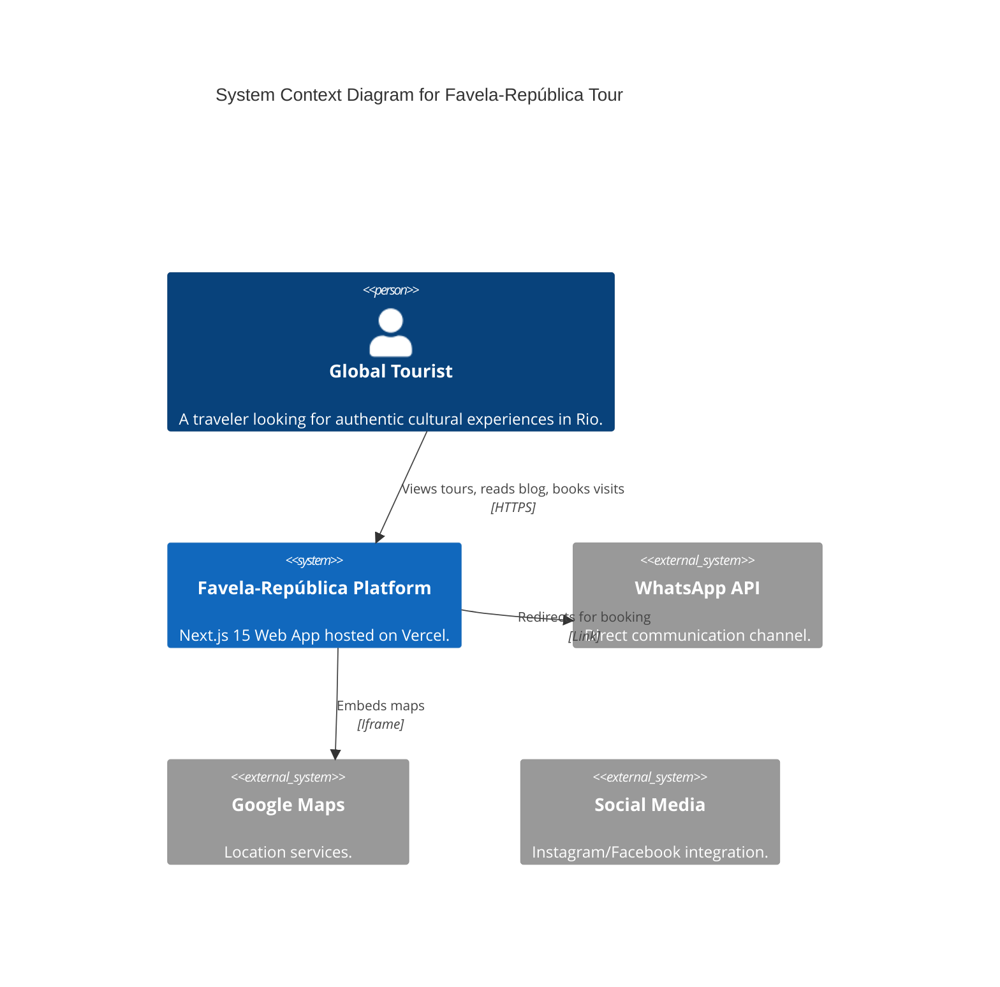

```mermaid
graph TD
    subgraph "Edge Network (Vercel)"
        CDN[CDN Cache]
        Middleware[i18n Middleware]
    end

    subgraph "Server (Next.js)"
        SSG[Static Pages (Build Time)]
        ISR[Incremental Static Regeneration]
        API[API Routes]
    end

    subgraph "Data Layer"
        Dict[JSON Dictionaries]
        Content[Markdown Blog]
    end

    User --> CDN
    CDN --> Middleware
    Middleware --> SSG
    SSG --> Dict
    ISR --> Content
```
